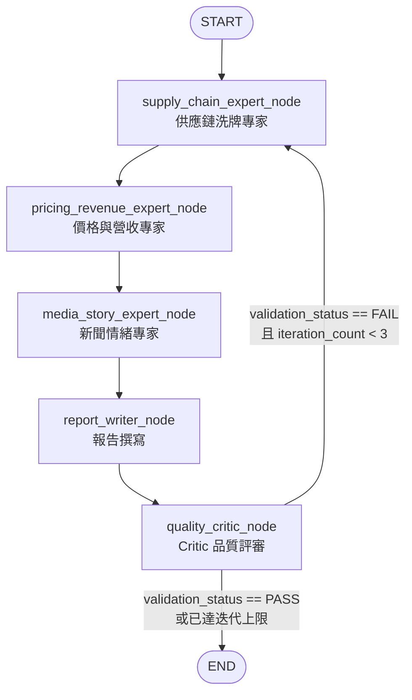
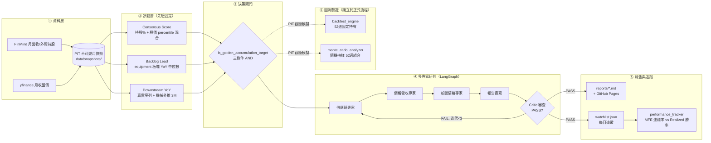

# 12-18 個月市場熱點預見與資訊自動收集系統

本系統是一套基於大師中期投資思維（**產品週期供應鏈洗牌**、**12-18個月能見度推演**、**高頻價格與營收 YoY 拐點預判**）所設計的自動化市場監控與多 Agent 研判系統。

系統透過模擬與收集高頻產業價格、Design Win 時程、歷史月度營收基期，並利用 LangGraph 狀態機協同三位專家 Agent（供應鏈專家、價格營收專家、新聞情緒專家）進行分析與 Self-Correction（自我修正）品質把關，最終自動生成繁體中文的學術級市場可行性評估報告。

---

## 1. 系統架構與設計思維

本系統高度整合了三位優秀投資人的中期投資心法：
1. **Product Cycle 的供應鏈洗牌效應**：追蹤主流架構（如 NVIDIA Blackwell $\rightarrow$ Vera Rubin $\rightarrow$ Feynman）物理限制突破後，特定零組件（如散熱、CPO 矽光子）在系統中的 **內含價值 (Content Value)** 變動，以及舊供應鏈的替代歸零風險。
2. **12-18 個月的能見度推演**：在大眾仍為當代產品放量歡呼時，多 Agent 系統已提前拆解下一代架構規格，並透過高頻封測稼動率等 Channel Check 數據進行動態修正。
3. **短期催化劑與新聞預警**：
   - 抓取 **高頻價格走勢**（如記憶體現貨價、材料價格）作為資金流入的先行 Catalyst。
   - 基於 **「去年低營收基期」** 與 **「今年出貨放量」**，模擬未來 3 個月營收年增率 (YoY) 即將爆發的拐點，在新聞滿天飛前 2-3 個月悄悄潛伏，並於散戶興奮時獲利了結。

---

## 2. 決策推演流程

本節逐層說明系統「從資料到結論」的完整推演路徑，以程式碼實際邏輯為準（`market_monitor.py` / `main_agent.py` / `ingest.py` + `pit_store.py` / `backtest_engine.py` / `monte_carlo_analyzer.py` / `performance_tracker.py`）。

### 2.1 資料層（PIT 鐵律）

系統的所有訊號都建立在 **Point-in-Time（PIT，時點正確）** 的不可變月快照之上，目標是杜絕回測中的 look-ahead bias。

- **資料來源**：`ingest.py` 從 FinMind（主）／TWSE（備）抓取月營收（`TaiwanStockMonthRevenue`）與外資持股（`TaiwanStockShareholding`），並以 yfinance 月 K（`interval="1mo"`）抓取月收盤價。
- **可見性規則（三種資料各自不同）**：
  - **月營收**：可見日＝FinMind `create_time`（實際公布日）；若無公布日則套用「次月 10 日」規則（`ingest._announce_date`）。
  - **外資持股**：以資料本身的日期作為可見日。
  - **月收盤價**：以該月**最後一個日曆日**（`close_date`）作為可見日，而非交易日。
- **落地層（`pit_store.py`）**：`write_monthly_snapshot(kind, payload, year_month)` 寫入 `data/snapshots/YYYY-MM/{revenue|holdings|prices}.json`；若目標檔已存在則丟出 `SnapshotExistsError`，**永不覆寫**——append-only 是鐵律。`read_snapshot(kind, as_of_date)` 只回傳「≤ as_of_date 所屬月份」中最新的一份快照。
- **鐵律精神**：任何時點 T 的訊號值，只能使用「在 T 當下已公布、已可見」的資訊組成；`market_monitor.py` 內部所有讀取都會用 `announce_date <= as_of_cutoff`（營收）或 `close_date <= as_of_cutoff`（股價）做日粒度過濾。

### 2.2 訊號層（三訊號，全部先驗固定、禁止回測調參）

三個訊號的定義、門檻與權重皆為 **pre-registered 先驗常數**（`docs/adr/0006-stage2-real-data-sourcing.md`），任何調整都不得用回測結果反推（否則構成 data snooping）。

**① Consensus（共識度，0–100 整數）**
由 `market_monitor._compute_consensus` 計算，取「外資持股%」與「股價」兩個子訊號**等權混合**：
- 每個子訊號各自算 (a) 自身近 12 個月**歷史百分位**（現值在過去 12 個月中的相對位置）＋ (b) universe 內**橫斷面同儕排名**（與其他標的的 12 個月百分位互相比較），兩者再等權平均。
- 股價快照不可得時，退化為僅用持股%；兩者皆不足（< 6 個月歷史）時回傳 `None`，由呼叫端 fallback 至靜態先驗 `consensus_score`。
- 最終結果**四捨五入為整數**並附上 `CONSENSUS_GRANULARITY_NOTE`：「粗粒度：12 檔樣本橫斷面百分位，一階約 ±8 分為雜訊，非精確分數」——因 12 檔小樣本的橫斷面百分位天生只有粗顆粒度，呈現小數點是假精度。

**② Backlog Lead（設備 Backlog 領先指標）**
由 `market_monitor.get_backlog_lead` 計算：取供應鏈矩陣中所有 `segment == "equipment"` 公司的**真實月營收 YoY 中位數**。
- 標示 `BACKLOG_SIGNAL_NOTE`：「板塊層代理訊號（equipment 分類公司月營收 YoY 中位數），非公司別訂單資料」——因免費資料無法取得逐公司在手訂單（order-book），此訊號本質是「板塊層的營收動能代理」，不是真正的訂單領先指標。

**③ Downstream YoY（下游營收年增率）**
由 `market_monitor.simulate_revenue_inflection` 組成：
- 歷史 9 個月＝真實 PIT 月營收 `yoy_pct` 序列（`_read_company_revenue_history`）。
- 未來 3 個月＝**機械外推情境**：以最後一筆真實 YoY 乘上固定加速係數（非 equipment 為 `[1.05, 1.15, 1.35]`，equipment 為 `[1.10, 1.25, 1.50]`）算出，標示 `REVENUE_PROJECTION_NOTE`：「機械外推情境（末值 × 固定加速係數），非模型預測」——明確不是任何模型的預測結果。
- 真實資料不足（< 3 筆快照）時，fallback 為以 `hashlib.md5` 為種子的合成序列，並標記 `has_real_data=False`。

### 2.3 決策閘門：`is_golden_accumulation_target`

三訊號最終匯聚到單一布林欄位，定義於 `market_monitor.py`：

```python
CONSENSUS_MAX = 60.0       # 共識度上限：< 此值才算「逆勢/未擁擠」
BACKLOG_LEAD_MIN = 50.0    # 設備 Backlog 領先門檻：> 此值才算「領先已動」
DOWNSTREAM_YOY_MAX = 15.0  # 下游當月營收 YoY 上限：< 此值才算「基本面未現/拐點前」

is_golden_accumulation_target = (
    consensus < CONSENSUS_MAX
    and equipment_lead_active_global   # sector_backlog_yoy > BACKLOG_LEAD_MIN
    and yoy_curve[8] < DOWNSTREAM_YOY_MAX
)
```

三條件必須**同時成立（AND）**，缺一不可：

| 條件 | 門檻 | 經濟直覺 |
| :--- | :--- | :--- |
| Consensus < 60 | 逆勢 / 未擁擠 | 市場尚未大幅追捧此股為題材受惠者，籌碼與資訊尚未充分定價 |
| Backlog Lead > 50 | 領先已動 | 上游設備端營收 YoY 已率先轉強，代表擴產/拉貨動作已經發生 |
| Downstream YoY < 15 | 拐點前 | 下游成品端營收基本面尚未反映在數字上，行情仍在潛伏期而非兌現期 |

**單一真相來源**：`main_agent.py` 的報告撰寫 prompt、`performance_tracker` 加入 watchlist 的邏輯、`backtest_engine.py`、`monte_carlo_analyzer.py` 全部直接讀取這個欄位，**不得另立門檻**（`main_agent.run_hotspot_scan` 程式碼註解明確引用 ADR 0003：「pre-registered 門檻不可回測 tune」）。

### 2.4 多專家研判層（LangGraph）

`main_agent.py` 以 LangGraph `StateGraph(MarketHotspotState)` 串接五個節點，狀態機流程如下：



- **supply_chain_expert_node**：推演 18-24 個月能見度下的 Content Value 洗牌與替代風險（呼叫 `get_supply_chain_schedule`）。
- **pricing_revenue_expert_node**：解析高頻報價與 Backlog／營收 YoY 數據（呼叫 `get_high_frequency_pricing` 與 `simulate_revenue_inflection`）。
- **media_story_expert_node**：依 Consensus 過濾非共識標的，規劃潛伏與退場的敘事時間表。
- **report_writer_node**：整合三位專家結論，撰寫五段式繁體中文學術級報告。
- **quality_critic_node**：以 Pydantic `CriticDecision` 結構化輸出審查報告是否同時包含（1）下下世代替代風險、（2）Backlog YoY 定量數據、（3）Consensus 非共識判定；`validation_status` 須為 `PASS` 才能寫入 `reports/`，否則 `run_hotspot_scan` 以 `sys.exit(1)` 失敗（依 `docs/adr/0005-agent-layer-no-fabrication-fail-loud.md`，不發布未通過審查的報告）。

**Critic 驗證與誠實化強制規則**：`docs/adr/0005` 訂定「不捏造、失敗即顯」契約——移除所有硬編碼 fallback、LLM 呼叫失敗時有限重試（`_invoke_with_retry`，2–3 次退避後 raise）、Critic 呼叫例外直接 raise（不再 auto-PASS）、三輪迭代仍未 PASS 則報告不發布。每個專家節點與報告撰寫節點的 prompt 中都嵌入 4 條**誠實化強制規則**（違反視為分析/報告不合格）：
1. `projected_peak_yoy_pct` / `future_3m_yoy` 只能稱為「機械外推情境」，禁止使用「預測」「展望」等暗示基本面研判的詞語。
2. `consensus_score` 呈現須標註「共識度 XX（粗粒度，±8 分為雜訊）」，不得暗示個位以下精度。
3. 只有 `is_golden_accumulation_target == True` 的公司才可稱為「非共識黃金潛伏標的」，其餘一律稱為「觀察名單（未過共識門檻）」，不得混用。
4. Backlog YoY 數據一律標示為「板塊層代理訊號」，不得寫成該公司自身的訂單/拉貨數字。

### 2.5 追蹤與驗證層

**Watchlist 每日更新**：`.github/workflows/daily_market_pipeline.yml` 定義兩條排程——平日每日執行 `python main_agent.py --daily-update`（不呼叫 LLM，僅呼叫 `performance_tracker.update_watchlist_daily_prices` + `generate_performance_report`，節省 token），每週一另行執行 `--weekly-report` 觸發完整 LangGraph 研判流程。審查通過（PASS）後，`run_hotspot_scan` 會將新出現、`is_golden_accumulation_target=True` 的標的以當日 yfinance 收盤價（或 PIT 股價快照 fallback）加入 `watchlist.json`。`update_watchlist_daily_prices` 更新每筆標的的 K 線與最高/最低/當前報酬，若 yfinance 抓取失敗會標記 `price_fetch_status="failed"` 而非靜默略過。

**Performance Tracker 雙指標**：`performance_tracker.generate_performance_report` 併陳兩個勝率口徑——
- **MFE 達標率**（最大潛在漲幅曾觸及 ≥15% 的比率）：非實現報酬，會高估真實可獲利性（因為那個高點未必真的賣得到）。
- **Realized 勝率**（以「當前實現報酬」≥15% 計算）：反映若持有至今的實際結果。
兩者併陳是為了讓讀者同時看到「理論上限」與「實際結果」，避免只看 MFE 造成過度樂觀的錯覺。

**回測引擎（`backtest_engine.py`）**：以週為步進單位，在每個模擬時間點呼叫 `simulate_revenue_inflection(as_of_date=...)` 做嚴格 PIT 截斷篩選，命中 `is_golden_accumulation_target` 即模擬買入。所有進場交易套用**固定持有期 52 週**（`HOLDING_PERIOD_WEEKS`）出場規則：
- 持有期已滿（`exit_date <= end_date` 且 `<= 今天`）→ 計算已實現報酬，標記 `exit_status="closed"`。
- 持有期未滿 → 標記 `"tracking_incomplete"`，不計入勝率分母。
- 進出場價格缺資料 → 標記 `"missing_data"`，同樣不計入分母（顯式排除，不得以 0.0 混入統計）。
- **交易成本假設**：買進手續費 0.1425%、賣出手續費 0.1425% + 證交稅 0.3%、滑價買賣雙邊各 0.1%（`apply_net_return`），已實現毛報酬與淨報酬分開呈現；MFE/MAE（期間最高/最低價）維持毛值，因該價位未必真正成交。
- 個股勝率門檻：單一標的最大漲幅 ≥15%。

**Monte Carlo 分析器（`monte_carlo_analyzer.py`）**：在 2015-01-01 至 2025-06-01 十年區間隨機抽樣時間斷面（預設 100 組，`--seed` 固定可重現），每組以「當時所有命中 `is_golden_accumulation_target` 的標的」組成**等權重投資組合**，追蹤 **52 週**。與回測引擎共用交易成本假設，但**勝率口徑不同**：組合平均最大漲幅 **≥30%** 才算成功（個股回測是 ≥15%），兩者定義對象不同（組合 vs. 個股），報告中明確註記「不可直接比較或視為調參前後對照」。

### 2.6 已知限制（誠實聲明）

- **Universe 為事後選定名單**：12 檔標的供應鏈池（`data/priors/content_value.json` 的 `eras`）是研究時依領域知識選定，而非某個時點下用規則篩選出的全市場結果。因此回測/蒙地卡羅勝率**不構成策略證據**，僅供機制驗證（PIT 邏輯、閘門邏輯是否運作正確），兩份報告皆有此警語。
- **yfinance 倖存者偏差**：股價資料只涵蓋目前仍在市場交易的標的，下市股不可見，可能高估歷史勝率。
- **小樣本 percentile 粗粒度**：12 檔橫斷面百分位一階本就約 ±8 分的雜訊量級，Consensus Score 呈現為整數也是承認這個限制，而非精確分數。
- **Backlog 無公司特異性**：Equipment Backlog Lead 是板塊層（segment=equipment 公司）YoY 中位數的代理訊號，不是任何單一公司的真實在手訂單/order-book 數據，不可解讀為「該公司訂單已經動起來」。

### 2.7 端到端總覽圖



---

## 3. 專案目錄結構

```text
.
├── .github/
│   └── workflows/
│       └── daily_market_pipeline.yml  # 每日自動化運行排程 (Cron + Keep-alive)
├── docs/
│   ├── adr/
│   │   ├── 0001-record-architecture-decisions.md
│   │   └── 0002-market-hotspot-anticipation-architecture.md  # 系統架構決策紀錄 (ADR)
│   ├── prd_market_hotspot_system.md       # 產品需求文件 (PRD)
│   └── architecture_and_cost_analysis.md  # 架設與每週運行 Token 成本評估報告
├── reports/                               # 產出的市場可行性報告存放目錄 (Markdown)
├── tests/                                 # 單元測試 (驗證監控器與狀態機流轉)
│   ├── test_monitor.py
│   └── test_agent_workflow.py
├── main_agent.py                          # LangGraph 狀態機與 Agent 節點邏輯
├── market_monitor.py                      # 數據收集、價值量變動與營收 YoY 拐點模擬引擎
├── requirements.txt                       # Python 必要依賴
├── AGENTS.md                              # 統一開發規範與紀律 (Antigravity & Claude 共享)
├── HANDOFF.md                             # 跨 Agent 交接狀態文檔
└── README.md                              # 本說明文件
```

---

## 4. 本地安裝與執行指南

### 4.1 環境配置
本專案建議使用 Python 3.10+ 環境。

1. **安裝依賴套件**：
   ```bash
   pip install -r requirements.txt
   ```
2. **設定環境變數**：
   系統撰寫報告與評審時預設使用 NVIDIA NIM 上的 GLM-5.2（`z-ai/glm-5.2`，OpenAI 相容端點）。請配置您的 API Key：
   - **Windows (PowerShell)**：
     ```powershell
     $env:NVIDIA_NIM_API_KEY="your-api-key-here"
     ```
   - **Linux / macOS**：
     ```bash
     export NVIDIA_NIM_API_KEY="your-api-key-here"
     ```
   > **備註**：必須設定 NVIDIA_NIM_API_KEY，否則主分析流程會在呼叫 LLM 時報錯。可選 `NIM_MODEL` 覆寫模型 ID（預設 `z-ai/glm-5.2`）。系統不整合 Ollama；惟各 Agent 節點在 LLM 呼叫失敗時，內建規則式模版作為降級產出，確保排程不中斷。

### 4.2 執行熱點分析
執行 `main_agent.py` 並指定目標板塊（例如 `CPO_Optical_Transceiver`）：
```bash
python main_agent.py --sector CPO_Optical_Transceiver
```
執行後，系統將運行 LangGraph 狀態機，三位專家將進行評估、Writer 撰寫報告、Critic 進行結構數據檢核（若缺失將自動回溯重構）。最終，產出的報告將被寫入 `reports/` 目錄，檔名格式為：
`reports/YYYY-MM-DD-<板塊名稱>-feasibility-report.md`。

> **註**：Stage 2 起，歷史營收改由 FinMind `TaiwanStockMonthRevenue` 回填為 PIT 月快照（2015-01 起，見 `ingest.py` 與 ADR 0006），歷史回測已使用真實營收；TWSE 開放 API（僅最新月份）降為 fallback/校驗來源。惟 universe 為事後選定名單，回測勝率仍不構成策略證據，僅供機制驗證（詳見 §2.6 已知限制）。

### 4.3 執行單元測試
本專案使用 `unittest` 框架驗證數據正確性與狀態機流暢度：
```bash
python -m unittest discover -s tests -p "test_*.py"
```

---

## 5. DevOps 自動化排程

系統在 `.github/workflows/daily_market_pipeline.yml` 中定義了自動運行的流水線，具備以下上線保障機制：
- **防止 Action 停用 (Keep-Alive)**：GitHub 會在 Repo 超過 60 天無 commit 時停用 Cron 排程。為此，工作流執行後會將 reports/、watchlist.json、docs/ 的變更自動 commit 並 push 回 main（commit 訊息含 [skip ci]），藉此維持 repo 活性。

---

## 6. 使用 GitHub Pages 進行無伺服器發佈與行事曆整合

為實現 **100% 免費、零維護成本** 的架構，系統在每週一自動執行完畢後，會由 `generate_static_pages.py` 自動將 Markdown 報告編譯為靜態 HTML 網頁並儲存於 `docs/` 目錄。您可以啟用 GitHub Pages 託管此目錄。

### 6.1 啟用 GitHub Pages 步驟
1. 進入您在 GitHub 的專案倉庫，點選右上角的 **Settings**。
2. 在左側選單中找到並點選 **Pages**。
3. 在 **Build and deployment -> Source** 中選擇 `Deploy from a branch`。
4. 在 **Branch** 選單中：
   - 分支選擇 **`main`**。
   - 目錄選擇 **`/docs`** (取代預設的 `/root`)。
5. 點選 **Save** 儲存設定。
6. 等待約 1 分鐘，GitHub 便會在頁面頂端給出您的專屬託管網址，例如：
   `https://<您的帳號>.github.io/market-hotspot-anticipation/`

### 6.2 網頁固定連結
啟用 Pages 後，您的行事曆固定瀏覽連結如下：
* **每週最新熱點報告 (首頁)**：
  `https://<您的帳號>.github.io/market-hotspot-anticipation/` 或 `index.html`
* **長期績效與勝率統計報告**：
  `https://<您的帳號>.github.io/market-hotspot-anticipation/performance.html`

> [!TIP]
> **私有專案 (Private Repo) 提示**：
> 如果您的 GitHub 專案是私有的且為免費帳戶（不支援私有 Pages），您仍然可以使用 GitHub 提供的 Raw 原始碼檢視連結來觀看，只需將瀏覽器安裝 `Markdown Viewer` 等 Chrome 擴充套件，即可直接點擊以下連結觀看最新渲染：
> * 最新熱點報告：`https://raw.githubusercontent.com/<您的帳號>/market-hotspot-anticipation/main/docs/index.html`
> * 系統績效報告：`https://raw.githubusercontent.com/<您的帳號>/market-hotspot-anticipation/main/docs/performance.html`

### 6.3 行事曆整合設定
1. 打開 Google 日曆（或您常用的手機行事曆）。
2. 在 **每週一早上 07:30** 新增一個重複的行事曆活動。
3. 將您的 **GitHub Pages 固定連結** 貼在活動的「連結」或「說明描述」欄位中。
4. 之後每週一早上時間一到，GitHub Actions 便會自動執行市場分析並將網頁推送至 Pages，您只需點開行事曆即可直接以精美的深色毛玻璃介面閱讀報告！

