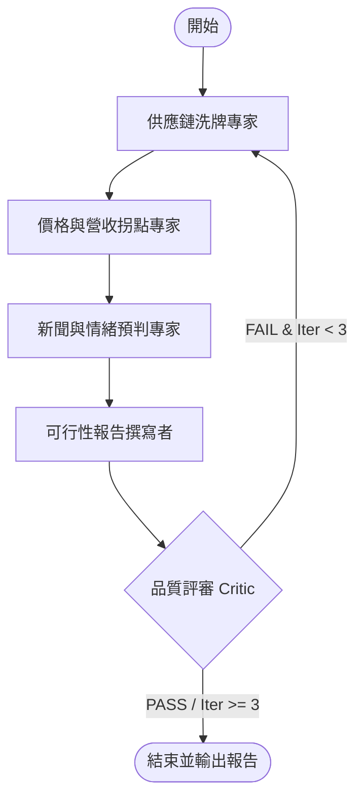

# 產品需求文件 (PRD) — 12-18 個月市場熱點預見與自動化資訊收集系統

## 1. 產品背景與商業目標

### 1.1 背景與痛點
在科技產業（尤其是半導體與 AI 供應鏈）中，傳統投資人依賴季報或已發布的新聞進行決策，往往面臨「利多出盡」或「追高住套房」的困境。市場資金是短視且敏感的，而頂尖投資人則能**保持 12-18 個月的能見度**，在當代產品放量時即開始拆解下一代架構，並在營收出現年增率 (YoY) 拐點前 2-3 個月悄悄佈局。

### 1.2 產品定位
本系統是一套**基於大師中期投資思維的自動化市場熱點預見與多 Agent 研判系統**。透過自動收集高頻產業數據、模擬營收 YoY 拐點，並利用 LangGraph 狀態機進行供應鏈洗牌推演與自我修正，最終產出學術級的中期市場可行性研究報告，協助決策者在新聞爆發前搶先佈局。

### 1.3 核心商業目標
- **領先市場 12-18 個月**：預判產品架構升級（如 NVIDIA Blackwell $\rightarrow$ Vera Rubin $\rightarrow$ Feynman）對供應鏈的「內含價值 (Content Value)」洗牌效應。
- **捕捉營收拐點**：在營收 YoY 拐點出現前 2-3 個月發出預警。
- **高頻數據驗證**：利用高頻價格（如記憶體現貨價、材料報價）進行中期趨勢的動態校正。

---

## 2. 核心功能規格

### 2.1 數據收集模組 (`market_monitor.py`)
負責模擬與收集三大中期投資指標：
1. **高頻價格監控 (High-frequency Pricing)**：
   - 追蹤關鍵材料、記憶體 (DRAM/NAND) 的現貨與合約報價。
   - 計算價格動量與趨勢反轉信號（例如：連續 3 週報價止跌回升）。
2. **供應鏈排程與價值量分析 (Supply Chain & Content Value)**：
   - 建立下一代架構的零組件價值矩陣。
   - 追蹤供應商的 Design Win 階段、開模、試產與放量 (Ramp-up) 時程。
   - 定位「供需瓶頸（如 CoWoS 產能）」。
3. **營收基期與拐點模擬器 (Revenue Inflection Simulator)**：
   - 抓取目標公司之歷史月度營收（以台股電子代工與零組件廠為核心樣板）。
   - 模擬在未來 3 個月出貨放量情境下，因去年低基期所產生的 YoY/MoM 爆發點。

### 2.2 多 Agent 決策狀態機 (`main_agent.py`)
基於 LangGraph 實作 Supervisor-Expert 模式，並具備 Critic 自我修正機制。



- **供應鏈專家 (Supply Chain Expert)**：評估架構升級帶來的內含價值佔比變化，及舊供應商的被替代風險。
- **營收與報價專家 (Pricing & Revenue Expert)**：彙整高頻報價趨勢與未來 3 個月營收 YoY 拐點模擬。
- **新聞預判專家 (Media & Storytelling Expert)**：推演拉貨動能與營收拐點，預估主流媒體開始集體報導（Storytelling）的時間點，評估最佳潛伏期。
- **報告撰寫者 (Writer)**：整合三位專家的定量與定性數據，撰寫傳統中文學術級可行性評估報告。
- **品質評審 (Critic)**：使用 Pydantic 強制結構化輸出。檢查報告中是否包含物理規格極限、Content Value 變動值、高頻報價走勢、營收 YoY 預測值。若否，輸出 FAIL 與回饋，退回首節點修正。

---

## 3. 接口合約 (Interface Contract)

為確保後續 Sub Agents 在不同模組實作時能無縫對齊，定義以下核心資料結構：

### 3.1 狀態定義 (`MarketHotspotState`)
```python
from typing import TypedDict, List, Dict, Any

class MarketHotspotState(TypedDict):
    target_sector: str                  # 目標行業/技術板塊 (例如: "CPO_Optical_Transceiver")
    current_generation: str             # 當前主流架構 (例如: "Vera_Rubin")
    next_generation: str                # 下一代架構 (例如: "Feynman")
    
    # 專家產出資料
    supply_chain_analysis: Dict[str, Any]  # 內含價值變動與替代風險
    pricing_revenue_analysis: Dict[str, Any] # 高頻價格趨勢與營收 YoY 模擬
    media_story_anticipation: Dict[str, Any] # 新聞發酵時間點與情緒評估
    
    # 報告與審查狀態
    feasibility_report_draft: str       # 報告草稿 (Markdown 格式)
    critic_feedback: str                # 評審反饋意見
    iteration_count: int                # 當前自我修正迭代次數
    validation_status: str              # 審查狀態: "PASS" 或 "FAIL"
```

### 3.2 數據監控器介面 (`MarketInformationMonitor`)
```python
class MarketInformationMonitor:
    def get_high_frequency_pricing(self, sector: str) -> Dict[str, Any]:
        """
        獲取高頻報價趨勢。
        """
        pass

    def get_supply_chain_schedule(self, current_gen: str, next_gen: str) -> Dict[str, Any]:
        """
        分析下一代產品架構演進下的供應鏈時程與價值量變化。
        """
        pass

    def simulate_revenue_inflection(self, company_ids: List[str]) -> Dict[str, Any]:
        """
        根據歷史基期與當前出貨模擬，預測未來 3 個月營收 YoY 拐點。
        """
        pass
```

---

## 4. 自動化與 DevOps 規格

### 4.1 每週排程自動化
- **觸發時間**：每週一 UTC 02:30（避開整點尖峰）。
- **紐約時區守護**：在 Linux/Bash 環境中以 `TZ="America/New_York"` 檢查當前美東時間，若遇到冬夏令時切換，自動校準與美股關閉後 12-18 小時的對齊性。
- **Keep-Alive 維持**：當掃描完成並產出最新 Markdown 報告於 `/reports` 後，使用 Git 自動 commit 並強制 push 至預設分支，附帶 `[skip ci]`，保持 Repo 活躍度，防止 GitHub 停用 Cron。
- **DeadMan Watchdog**：
  - 開始步驟發送：`curl -FSs --retry 3 https://deadmancheck.io/ping/<START_TOKEN>`
  - 成功步驟發送：`curl -FSs --retry 3 https://deadmancheck.io/ping/<DONE_TOKEN>`

---

## 5. 驗證標準 (Acceptance Criteria)

1. **功能驗證**：
   - 執行 `main_agent.py` 能成功抓取 `market_monitor.py` 產出的數據。
   - 在 Critic 判定為 "FAIL" 反饋時，LangGraph 狀態機能流暢回溯，並在重新生成後通過審查。
2. **輸出驗證**：
   - 生成的可行性研究報告存放在 `reports/` 下，檔名採用 `YYYY-MM-DD-<技術板塊>-feasibility-report.md`。
   - 報告全文需採用繁體中文，語氣具備學術研究報告之嚴謹度，且定量數據（Content Value 變動、報價、YoY 預測）佔比不低於 40%。
